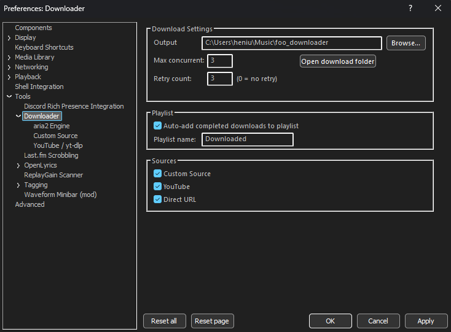

# foo_music_downloader

A download manager component for [foobar2000](https://www.foobar2000.org/) v2.x (x64). Search, download, and queue audio files directly from within foobar2000 using a plugin-style source provider architecture.

## Features

- **Integrated download panel** &mdash; dockable UI element with source selector, URL/search input, and a live download queue showing title, status, progress, speed, and source
- **YouTube search & download** &mdash; search YouTube by keyword, pick tracks from a results dialog with quality selector, and download audio via [yt-dlp](https://github.com/yt-dlp/yt-dlp). Supports FLAC, WAV, MP3, AAC, Opus, and Vorbis at configurable quality levels
- **Direct URL downloads** &mdash; paste any direct file link and download it via [aria2](https://aria2.github.io/)
- **Custom Source** &mdash; configurable search and download source for compatible APIs (requires user-provided base URL)
- **Extensible source providers** &mdash; plugin-style architecture makes it easy to add new download sources
- **aria2 download engine** &mdash; high-performance downloads with multi-connection support, pause/resume, retry, and JSON-RPC control. aria2 runs as a managed background daemon
- **Automatic playlist integration** &mdash; completed downloads are automatically added to a configurable playlist (default: "Downloaded")
- **Download history** &mdash; persistent SQLite-backed history of all completed and failed downloads, with automatic migration from older text-based history
- **Context menu integration** &mdash; right-click in any playlist to access "Downloader > Download from URL..." with automatic clipboard URL detection
- **Queue management** &mdash; right-click downloads in the queue to play completed files, open containing folder, pause/resume, cancel, or remove entries
- **Dark mode support** &mdash; follows foobar2000's dark mode setting across all dialogs
- **Configurable** &mdash; preferences under Tools > Downloader with sub-pages for YouTube/yt-dlp and aria2 engine settings

## Screenshots




## Installation

### From .fb2k-component (recommended)

1. Download `foo_downloader.fb2k-component` from the [Releases](../../releases) page
2. Double-click the file &mdash; foobar2000 will install it automatically
3. Restart foobar2000

### Manual install

1. Copy `foo_downloader.dll` and `aria2c.exe` into:
   ```
   %APPDATA%\foobar2000-v2\user-components-x64\foo_downloader\
   ```
2. Restart foobar2000

## Usage

### Adding the Downloader panel

1. Go to **View > Layout > Enable layout editing mode**
2. Right-click an empty area and select **Add panel > Downloader**
3. Disable layout editing mode

### Downloading

1. Select a source from the dropdown (YouTube, Direct URL)
2. Enter a search query or URL
3. Click **Search** / **Download**
4. For YouTube: pick tracks from the search results dialog, choose quality, and confirm
5. Downloads appear in the queue with live progress and speed

### Context menu

Right-click any track in a playlist and select **Downloader > Download from URL...** to open a download dialog. If a URL is on the clipboard, it will be auto-filled.

### Queue context menu

Right-click any item in the download queue for options:
- **Play** &mdash; play a completed download immediately
- **Open folder** &mdash; open the containing folder in Explorer
- **Pause / Resume** &mdash; pause or resume aria2 downloads
- **Cancel** &mdash; cancel an active download
- **Remove** &mdash; remove from the queue

## Configuration

Open **Preferences > Tools > Downloader** to configure:

### Main page

| Setting | Description | Default |
|---------|-------------|---------|
| Output folder | Where downloaded files are saved | `Music\foo_downloader` |
| Max concurrent | Maximum simultaneous downloads | 3 |
| Retry count | Number of retries on failure (0 = no retry) | 3 |
| Auto-add to playlist | Automatically add completed downloads to a playlist | Enabled |
| Playlist name | Name of the target playlist | "Downloaded" |
| Sources | Enable/disable individual source providers | All enabled |
| Custom Source URL | Base URL for the custom source API | Empty |

### YouTube / yt-dlp sub-page

| Setting | Description | Default |
|---------|-------------|---------|
| yt-dlp path | Path to `yt-dlp.exe` (auto-detected from component folder) | Auto |
| Default quality | Audio quality for YouTube downloads | FLAC (lossless) |
| Embed metadata | Embed metadata and thumbnail into downloaded files | Enabled |
| Extra flags | Additional yt-dlp command-line flags (e.g. `--cookies-from-browser chrome`) | Empty |

> **Note:** On first use, the component downloads `yt-dlp.exe` automatically. Foobar2000 may appear to freeze during this download. This is normal and only happens once.

### aria2 Engine sub-page

| Setting | Description | Default |
|---------|-------------|---------|
| aria2c path | Path to `aria2c.exe` (auto-detected from component folder) | Auto |
| RPC port | JSON-RPC port for aria2 daemon communication | 6800 |

## Architecture

```
foo_downloader/
  component.cpp            # Component registration, init/quit lifecycle
  source_manager.cpp/h     # Registry of source providers, enable/disable logic
  source_provider.h        # ISourceProvider interface
  download_manager.cpp/h   # Download queue, polling, history (SQLite), yt-dlp process management
  aria2_rpc.cpp/h          # aria2 JSON-RPC client, daemon lifecycle
  preferences.cpp          # Three preferences pages (main, YouTube, aria2)
  ui_panel.cpp             # Dockable Downloader panel (UI element)
  contextmenu.cpp          # Right-click "Download from URL..." integration
  playlist_utils.cpp/h     # Auto-add to playlist logic
  dialogs.rc               # All dialog templates
  resource.h               # Control IDs
  guids.h                  # GUIDs for all services, configs, and UI elements
  sources/
    source_direct_url.h    # Direct URL pass-through source
    source_custom.cpp/h    # Custom Source (configurable base URL)
    source_youtube.cpp/h   # YouTube search + yt-dlp integration
```

### Adding a new source provider

1. Create `sources/source_myapi.h` (and `.cpp` if needed) implementing the `ISourceProvider` interface:
   ```cpp
   class MyApiSource : public ISourceProvider {
   public:
       const char* GetId() const override { return "myapi"; }
       const char* GetName() const override { return "My API"; }
       bool Resolve(const char* input, std::vector<DownloadItem>& items, std::string& errorMsg) override;
   };
   ```
2. Register it in `source_manager.cpp`:
   ```cpp
   Register(std::make_unique<MyApiSource>());
   ```
3. Add the source file to `foo_downloader.vcxproj`
4. Rebuild &mdash; the new source appears automatically in the UI dropdown

### Download engines

| Engine | Used for | Features |
|--------|----------|----------|
| **aria2** | Direct URL downloads, Custom Source | Multi-connection, pause/resume, retry, managed daemon |
| **yt-dlp** | YouTube downloads | Audio extraction, format conversion, metadata embedding |

## Building from source

### Prerequisites

- **Visual Studio 2022** with "Desktop development with C++" workload (MSVC, Windows SDK, C++ ATL)
- **foobar2000 v2.x** portable install for debugging (default: `C:\Dev\foobar2000_dev\`)
- **7-Zip** (needed by the setup script to extract the SDK)

### Setup

```powershell
git clone <repo-url>
cd FoobarDownloader

# Download all SDK dependencies (foobar2000 SDK, WTL, SQLite, aria2c)
powershell -ExecutionPolicy Bypass -File setup_deps.ps1
```

### Build

**Via Visual Studio:**
1. Open `foo_downloader.sln` in Visual Studio 2022
2. Select **Debug | x64** or **Release | x64**
3. Build (Ctrl+Shift+B)
4. For Debug: press F5 to launch foobar2000 with debugger attached

The Debug post-build step automatically copies the DLL and aria2c.exe to the foobar2000 components folder.

**Via command line:**
```powershell
# Find and use MSBuild directly
& "${env:ProgramFiles(x86)}\Microsoft Visual Studio\Installer\vswhere.exe" -latest -requires Microsoft.Component.MSBuild -find 'MSBuild\**\Bin\MSBuild.exe'

# Build Debug
msbuild foo_downloader.sln /p:Configuration=Debug /p:Platform=x64 /m

# Build Release
msbuild foo_downloader.sln /p:Configuration=Release /p:Platform=x64 /m
```

### Package for release

```powershell
powershell -ExecutionPolicy Bypass -File package.ps1
```

This builds Release|x64 and produces `foo_downloader.fb2k-component` (a ZIP containing `foo_downloader.dll` + `aria2c.exe`).

## Requirements

- **foobar2000 v2.x** (x64 only)
- **Windows 10** or later
- Internet connection for downloads

## Custom Source API

The **Custom Source** is a configurable download source that works with any server implementing the expected API. To use it, set the base URL in **Preferences > Tools > Downloader > Custom Source** (e.g., `https://example.com`). Enter only the domain — do not include any path. The component appends the API paths automatically.

### Required API endpoints

#### Search: `GET {baseUrl}/flac/search?query={query}`

Returns a JSON response with search results:

```json
{
  "data": [
    {
      "id": 12345,
      "title": "Song Title",
      "duration": 240,
      "artist": {
        "name": "Artist Name"
      },
      "album": {
        "title": "Album Title"
      }
    }
  ],
  "total": 1
}
```

| Field | Type | Description |
|-------|------|-------------|
| `data` | array | Array of track objects |
| `data[].id` | integer | Unique track identifier (used in download URL) |
| `data[].title` | string | Track title |
| `data[].duration` | integer | Track duration in seconds |
| `data[].artist.name` | string | Artist name |
| `data[].album.title` | string | Album title |
| `total` | integer | Total number of results |

#### Download: `GET {baseUrl}/flac/download?t={id}&f=FLAC`

Returns the audio file as a binary stream. The `t` parameter is the track `id` from the search results, and `f` specifies the desired format.

### Notes

- The component sends standard browser-like headers (Referer, User-Agent, etc.) with download requests
- If the base URL is not configured, the source will show an error message directing the user to preferences
- The source appears in the UI dropdown as "Custom Source" and uses the "Search" action label

## Disclaimer

This project is provided strictly for **educational and research purposes**. It is intended as a demonstration of foobar2000 component development, plugin architectures, and download engine integration.

The authors do not condone or encourage the use of this software to download copyrighted material without proper authorization. Users are solely responsible for ensuring that their use of this software complies with all applicable laws and the terms of service of any platforms they interact with.

The Custom Source connects to a user-configured server. The authors of this project are **not affiliated with, connected to, or endorsed by** any third-party website or service. Users are responsible for ensuring they have the right to access and download content from whatever server they configure. The authors take no responsibility for the availability, legality, or content provided by third-party services.

**Use at your own risk.** The authors assume no liability for any misuse of this software.

## License

MIT License. See [LICENSE](LICENSE) for details.

This project bundles [aria2](https://github.com/aria2/aria2) which is licensed under GPL v2.
